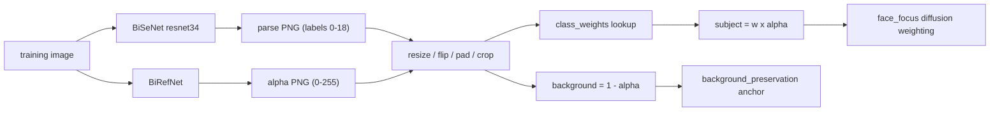

# Face parsing (per-class loss weights)

`face_mask_source: face_parse` replaces the face box or background-removal
silhouette with a 19-class BiSeNet segmentation of every training image. It is
the most precise mask source lorakit has, because it is the only one that can
tell **clothing** apart from the subject and can weight **face skin** differently
from hair and neck.

That buys three things:

1. **Clothing never enters the LoRA.** Outfits are the single strongest source of
   spurious correlation in a small portrait set: if the subject wears the same
   jacket in twelve of fifteen photos, the LoRA learns the jacket. Clothing is
   excluded from the diffusion loss.
2. **Skin stops dominating.** Skin is by far the largest region in a portrait, so
   at full weight it soaks up most of the loss and pushes the LoRA toward
   memorizing this particular lighting and pose. The default `skin: 0.5` leaves
   hair, neck, and the small features carrying the identity signal.
3. **Zoom-out augmentation becomes usable.** With clothing already removed from
   the loss, the canvas can be padded: invented pixels get zero training weight
   and full background-anchor weight, so training can see the face at scales
   smaller than the source framing without the LoRA learning the padding.

## Quick start

```bash
lorakit-parse /path/to/dataset --preview
```

```yaml
train:
  face_mask_source: face_parse
  face_parse:
    class_weights:
      skin: 0.5
  face_focus:
    enabled: true
  background_preservation:
    enabled: true
    weight: 0.5
```

The parse step also runs automatically at the start of training when
`face_parse.auto_build` is true (the default) and the maps are missing or older
than the images. `lorakit-parse` is only needed to inspect the result up front or
to parse on a different machine.

## The two weight maps

Every training sample carries two latent-resolution maps, and they are
deliberately **not** complements:

| Map | Meaning | Consumed by |
|---|---|---|
| subject | multiplies the diffusion loss | `face_focus` |
| background | weight for anchoring a pixel to the frozen base UNet | `background_preservation` |

If the background term simply used `1 - subject`, half-weighted skin would be
pulled halfway back toward the base prediction, which is exactly the identity
signal the LoRA is supposed to learn. So the two maps come from two questions
asked separately: *how much should this pixel be trained* and *is this pixel
part of the scene*.

### Where each map comes from

The parser is trained on face crops. Inside the person it is excellent, but out
in the scene it sprinkles stray `hair` and `skin` labels over dark furniture,
patterned upholstery and bare arms. On a ten-image portrait set that was 2-5% of
the frame per image: holes in the anchor, and full-weight diffusion loss landing
on a couch.

BiRefNet has the opposite profile — it knows nothing about facial structure but
draws a very clean person/scene boundary. So by default `face_parse` uses both,
and lets each decide what it is good at:

- **subject** = `class_weights[label] x alpha` — the parse map grades the weight,
  the alpha confines it to the person.
- **background** = `1 - alpha` — the scene, straight from the segmenter.



This leaves three zones rather than two. The person's non-face pixels — clothing,
arms, torso — are trained at zero *and* anchored at zero. That is the honest
answer: the base model has no opinion about an outfit it was never shown, so
holding the LoRA to its prediction there would be anchoring noise.

Set `face_parse.background_source: parse` to skip BiRefNet and derive the anchor
from the parser's own `background`/`cloth` classes instead. That saves the second
segmentation pass, and it does anchor clothing, but it inherits the stray labels
described above.

```yaml
face_parse:
  background_source: subject_mask   # default; "parse" to use BiSeNet alone
```

BiRefNet settings (model id, device, folder) are read from the `subject_mask:`
block, the same one `face_mask_source: subject_mask` uses.

## Classes and groups

Weights are set per group or per individual class; an individual class overrides
its group.

| Group | Classes | Default weight |
|---|---|---|
| `skin` | `skin` | 0.5 |
| `hair` | `hair` | 1.0 |
| `neck` | `neck` | 1.0 |
| `features` | `l_brow`, `r_brow`, `l_eye`, `r_eye`, `l_ear`, `r_ear`, `nose`, `mouth`, `u_lip`, `l_lip` | 1.0 |
| `accessories` | `eye_g`, `ear_r`, `neck_l`, `hat` | 0.0 |
| `cloth` | `cloth` | 0.0 |
| `background` | `background` | 0.0 |

```yaml
face_parse:
  class_weights:
    features: 0.8   # whole group
    l_eye: 1.0      # one class, overrides the group
```

Accessories default to 0 so glasses, hats and jewelry are treated like clothing:
worn, not part of the person. If your subject's glasses *are* part of the likeness
you want, set `eye_g: 1.0`.

Useful adjustments:

- **Identity is not converging.** Raise `skin` toward `0.75`. Halving skin is a
  regularizer; on a large, varied set it can be too much.
- **The LoRA reproduces the training hairstyle everywhere.** Lower `hair` to
  `0.5`, or set it to `0.0` to exclude and anchor hair entirely.
- **Neck/collar artifacts.** `neck` and `cloth` share a soft boundary at high
  collars; lowering `neck` to `0.5` reduces the bleed.

## Storage format

Parse maps are stored as raw class indices, not as pre-baked weights, so changing
`class_weights` is a config edit rather than a re-parse of the dataset.

```
{dataset_folder}/face_parse/
  parse.json          manifest: file name, source size, per-class coverage
  <stem>.png          mode L, values 0-18 (0 = background), source resolution
  previews/<stem>.jpg only with --preview
```

Maps are rebuilt when `parse.json` is missing or unreadable, an entry or PNG is
gone, or a source image is newer than the manifest.

## Zoom-out augmentation

```yaml
augmentation:
  variants: 6
  scale_min: 0.6
  scale_max: 1.3
  random_flip: true
  pad_mode: reflect
```

`scale_min` below 1.0 shrinks the image and pads the canvas back to the training
resolution. Each axis is padded by its full deficit on *both* sides, so the random
crop still has room to move the subject around rather than pinning it dead center.
Padded pixels are never trained (`subject = 0`) but are fully anchored
(`background = 1`), so the LoRA is held to the base prediction on invented canvas
instead of being free to drift there.

This is gated on a per-pixel mask source. With `manifest` there is no way to mark
the padding, so the model would learn to reproduce it, and the config is rejected.

`pad_mode` picks the filler:

- `reflect` (default) mirrors the border, which matches natural image statistics
  best. On a tightly cropped portrait it can mirror part of the face into the
  padding; the duplicate carries no loss weight but is still VAE context, so
  prefer `edge` or a milder `scale_min` for tight crops.
- `edge` smears the border pixel outward. Safe, visibly artificial.
- `constant` pads with black.

`scale_min` is clamped at `0.25`. Below that the subject is a thumbnail in a sea
of invented canvas and the context stops resembling a photograph.

## Verifying the result

With `dump_face_masks: true` (the default) each run writes
`{experiment}/face_parse/` from the *augmented* dataset variants, so it confirms
that zoom, flip, padding and cropping kept the weights aligned with the pixels:

- `NNNN_train.png` / `NNNN_background.png` — the two weight maps
- `NNNN_overlay.jpg` — trained region tinted green, anchored region tinted red,
  everything else left untinted

A correct overlay has green hair and features, mid-green skin, an evenly red
scene (including zoom-out padding) with no dark speckles in it, and no tint on
clothing. Speckles in the red area mean the anchor has holes; with the default
`background_source: subject_mask` there should be none. A black frame around a
zoomed-out sample means padding was dropped from the anchor — that is a bug.

At training time, watch `background_face_coverage` (fraction of the frame being
trained) against `background_anchor_coverage` (fraction anchored to the base
model). These will not sum to 1; the remainder is clothing (and any other
non-face body the parse map excludes).

## Model

## Models

`models/face-parsing-bisenet-resnet34/` — see its
[model card](../models/face-parsing-bisenet-resnet34/model_card.md) for the class
table, input contract and limits. The architecture lives in
[src/lorakit/face_parsing_net.py](../src/lorakit/face_parsing_net.py) and uses
only torch and torchvision.

BiRefNet is pulled from the Hub on first use. Its remote code needs `timm`,
`einops` and `kornia`, which are ordinary dependencies rather than an extra:
masks are built mid-run by `auto_build`, and a training run cannot install an
extra for itself.

## Comparison with the other mask sources

| Source | Region | Separates clothing | Graded weights | Cost |
|---|---|---|---|---|
| `face_parse` | 19-class segmentation | yes | yes | offline BiSeNet pass (+ BiRefNet) |
| `subject_mask` | subject silhouette | no | no | offline BiRefNet pass |
| `manifest` | face box | no | no | offline InsightFace pass |

`face_parse`, `subject_mask`, and `manifest` are all exact at every noise level.
